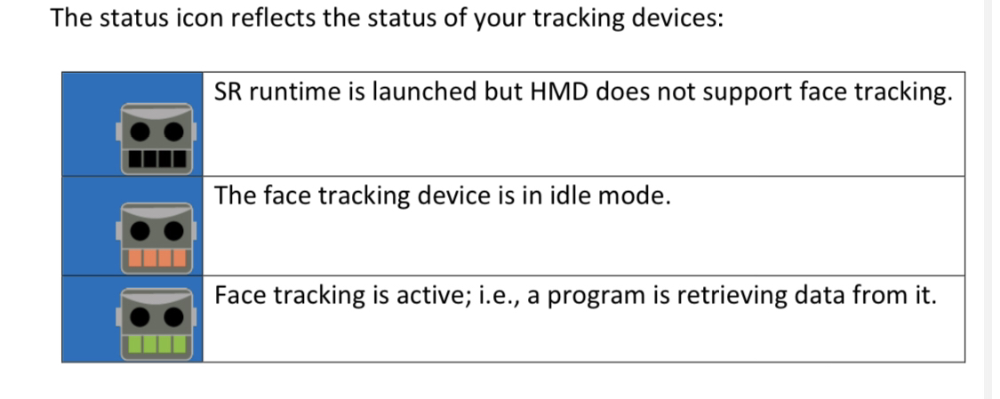

=====================
SRanipal
=====================

.. note::

   Document under construction

Summary
=======
SRanipal is the runtime used to interface with Vive Facial Tracker and other eye / face tracking related hardware. 
SRanipal stands for Super Runtime Animation Pal. 

.. _SRanipal Setup:

SRanipal Setup
==============
There are three methods of installing SRanipal: 

#. Install Vive Console (avaliable on Steam or Vive website)
#. Use the v1.3.6.5 zip of SRanipal in the VRCFT Discord #file-share channel
#. Use the installer of SRanipal v1.3.1.1 

Due to VRCFaceTracking's recent UE update, the SRanipal module tracking libraries have been updated to the latest binaries. 
Consequently, a SRanipal runtime older than 1.3.6.5 will not be compatible with the default SRanipal tracking library for VRCFT. 

.. SRanipal support for the Vive Facial Tracker basically hasn't been updated since v1.3.1.1. Version 1.3.2.0 introduced a performance bug that would cause an unreasonable amount of CPU usage by the runtime, with no
.. other notable difference from v1.3.1.1. There have been newer versions of SRanipal corresponding with fixes and features for the Vive Focus 3, so these newer versions are **not necessary** better than 1.3.1.1.
.. In fact, any version over version 1.3.6.8 will be incompatible with non-Vive Pro headsets, as a check was added to SRanipal initialization for the existence of a Vive Pro headset connected to the PC on startup in later versions. 
.. Version 1.3.6.5 is not *known* to have any notable benefits over v1.3.1.1. Some users have reported less resource utilization / better performance as compared to v1.3.1.1, but such claims are not verified. 

Thus: 

    - Vive Pro series users should generally use options 1 or 2
    - Most other users should use option 2, with option 3 as a last resort alternative.

Installing Via Vive Console 
---------------------------

#. It is recommended to install Vive Console via Steam: https://store.steampowered.com/app/1635730/VIVE_Console_for_SteamVR/
#. After install, run Vive Console once to let it's internal installers run. You never need to run Vive Console again. 

   - An alternative is to go to the Vive Console install location(``Steam\steamapps\common\VIVEDriver\App\SRanipal``) and simply run the driver installer in that folder, and never touch Vive Console. 
   - Vive Console does take up a lot of space (~1.6Gb), so copying the SRanipal folder out, then uninstalling Vive Console is another avenue. 

Installing Via v1.3.6.5 .zip
-----------------------------

#. Download the SRanipal v1.3.6.5 .zip: https://discord.com/channels/849300336128032789/915075185328152606/1017600042837753906
#. Unzip the folder and run ``DriverInstaller.msi``

Installing Via v1.3.1.1 Installer
---------------------------------

#. Download the SRanipal v1.3.1.1 installer: https://drive.google.com/file/d/16Qbl2NKHCBK_8osIDu0o1-03WFiDxtMX/view?usp=sharing
#. Run the installer and complete the installation process
#. Download the old set of SRanipal binaries (link here) and replace the VRCFT SRanipal ModuleLibs

.. wasn't there a mirror on Ben's server somewhere 

**Important:** The installer for v1.3.1.1 is has a known failure point during installation: **Error 1001**. It is not entirely clear why it happens. 

    .. image:: images/vive_installer_error_1001.png
        :width: 500
        :align: center
        :alt: sranipal error 1001

In case you encounter this error when attempting to install SRanipal v1.3.1.1, you can either

#. Ignore the warning message, pull computer power so the installer doesn't uninstall anything, and use v1.3.1.1 anyways because Error 1001 is meaningless, or
#. Attempt :ref:`uninstalling sranipal` and seeing if it installs correctly after
#. Install SRanipal via one of the other options (Vive Console or the v1.3.6.5 zip)

.. _Uninstalling SRanipal:

Uninstalling SRanipal
=====================

In case SRanipal seems to have some issues (especially after having mixed different versions) and the SRanipal installer seems to be unable to uninstall SRanipal, follow these instructions from Vive Admin C.T.: 
https://forum.htc.com/topic/5642-sranipal-getting-started-steps/?do=findComment&comment=46845

Using SRanipal
===============

Once SRanipal initializes, the tray icon can show a few possible states indicating the status of SRanipal-compatible hardware connected to the computer. 

+--------------+-----------------------------------------------------------------+--------------------------------------------------------------------+
| Area/        | Eye                                                             | Mouth                                                              |
| Color        |                                                                 |                                                                    |
+==============+=================================================================+====================================================================+
| Black (Dark) | Eye tracker (VPE) was not detected                              | Vive Facial Tracker was not detected                               |
+--------------+-----------------------------------------------------------------+--------------------------------------------------------------------+
| Orange       | Eye tracker (VPE) was detected, currently uninitialized         | Vive Facial Tracker was detected, currently uninitialized          |
+--------------+-----------------------------------------------------------------+--------------------------------------------------------------------+
| Green        | Eye tracker (VPE) was initialized and sending eye tracking data | Vive Facial Tracker was initialized and sending face tracking data |
+--------------+-----------------------------------------------------------------+--------------------------------------------------------------------+
| Purple       | Eye tracker (Focus 3) successful connection                     | Face Tracker (Focus 3) successful connection                       |
+--------------+-----------------------------------------------------------------+--------------------------------------------------------------------+

Calibrating Eye Tracking
------------------------

After installing SRanipal, a new app will be added to your SteamVR dashboard called "Vive Pro Eye Calibration". This app is **only for Vive Pro Eye** (and the Droolon F1 module). 

Start calibration by making sure "Use Eye Tracking" is enabled, then hitting the "Calibrate" button in the app. Follow the in-app instructions to finish calibrating the eye gaz tracking.  

.. If in the rare case that eye tracking fails to calibrate (and you have a **Vive Pro Eye**), the cause is most likely your face being too clo

Common Issues (and How to Solve Them)
=====================================

- SRanipal starts but cannot right-click the tray icon. 